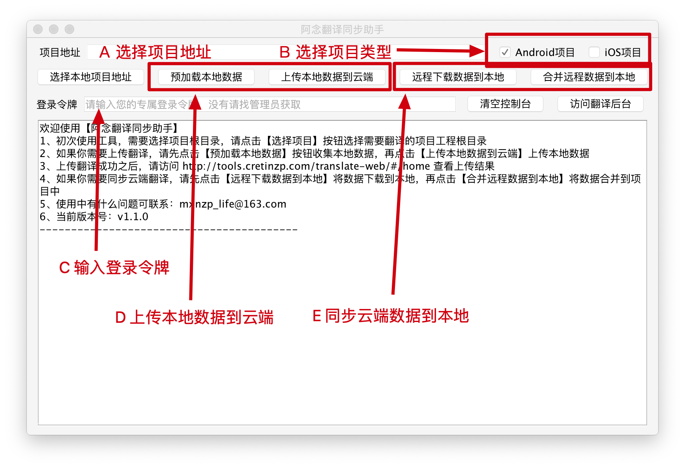
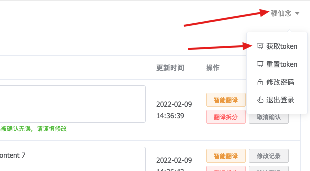

# 翻译系统后台管理项目

此项目已经以博客的形式完整输出使用方式，详情请查看：https://mp.weixin.qq.com/s/R7-fOpPM4QWR4dcN7K3h_Q

## 1、项目背景

项目要走向国外市场，移动端Android和iOS需要进行国际化适配，但是之前的项目中是没有英文翻译文件的，所以需要将项目中所有的中文字符串进行收集交给专业的人士进行翻译，然后将翻译的英文内容分别整理到Android和iOS项目中去。

无疑这是一个很繁琐且很容易出错的事情，而且后续在开发的过程中还会新增中文字符串，这个时候我们又需要重新走一遍上面的流程，于是我们需要一个系统去专门处理这件事件，将功能开发和英文翻译这两件事分离开来，所以这个翻译系统出现了。

## 2、项目说明

此项目分成三个部分，一个是翻译系统服务端，一个是翻译管理后台，一个是翻译同步助手。

### 2.1 翻译系统服务端

这个项目是一个springboot应用，数据库采用mysql，缓存采用redis。目前部署在一台空闲的阿里云服务器中。

服务端主要是提供功能api接口，包括后台管理系统的接口和翻译同步助手的接口，目前总共有17个接口，所有接口都由AdminTranslateController这个类提供。

服务端项目地址为：https://github.com/MZCretin/java-translate-server 如果你感兴趣可以clone下来看看。

### 2.2 翻译管理后台

这个是项目是用vue开发的前端项目，本项目就是其项目源码，ui框架使用的是element-ui，请求框架用的是axios。

管理后台主要有三个页面，一个是翻译工具下载页面，一个是翻译模块配置页面，一个是国际化翻译页面。

如果你想本地跑起来，先安装node环境，然后npm install，npm run serve，最后访问：http://127.0.0.1:8080 即可。

#### 2.2.1 翻译工具下载页面

这个页面主要是提供翻译同步助手的下载入口，当然了，因为翻译同步助手是用java写的，所以你需要有java环境，所以这个页面也提供了各个版本jdk的下载入口。

#### 2.2.2 翻译模块配置页面

这个页面主要是给模块配置模块名称，这样在国际化翻译系统页面可以根据模块去筛选翻译内容。

#### 2.2.3 国际化翻译页面

这个页面主要是给专业人士进行翻译的，在这里可以对中文进行人工翻译，也提供了百度翻译的智能翻译功能，还可以查看翻译的修改记录，追踪翻译历史链路，也提供了一系列对翻译条目的筛选功能和搜索功能。

### 2.3 翻译同步助手

这是一个纯java swing 项目，主要功能为 上传本地中文字符串到远程翻译系统 和 拉取远程已经翻译好的英文翻译到本地。服务端项目地址为：xxx 。该项目中的translate-tools模块就是翻译同步助手的项目源代码。

#### 2.3.1 上传本地中文字符串

拉取Android项目中所有的中文strings.xml中的中文字符串和iOS中所有的中文字符串，并主动去重，然后调用后端接口将本地中文字符串上传到云端。

#### 2.3.2 拉取远程翻译内容

调用后端接口拉取后端已经翻译好的英文内容到本地，对于Android项目，根据values/strings.xml生成对应的values-en/strings.xml文件，对于iOS，生成对应的en.lproj/Localizable.strings 文件。针对Android项目，每次在生成英文版本的strings.xml文件的时候，就自动将之前的strings.xml进行备份，防止出现误操作无法找回之前的数据。

## 3、体验一下

你先访问 http://tools.cretinzp.com/translate-web/#/home 首次登录没有账号密码就随便写一个，后台会自动帮你注册，但是你要自己记住这个账号密码，方便后面继续登录。

成功进入系统之后，访问  http://tools.cretinzp.com/translate-web/#/translate/tools 下载最新版本的翻译同步助手。如果你本机没有java环境，你还需要在此页面下载你当前系统对应的jdk，并一路下一步安装。安装成功之后，打开刚刚下载的翻译同步助手，你将看到如下页面：

+ A、如果你是Android开发者，那你点击选择本地项目地址按钮，选择你需要国际化项目的项目根目录就好了，选择完之后控制台会输出你选择的地址，请一定关注一下你选择的地址是否正确；如果你是iOS开发者，那你点击选择本地项目地址按钮，选择项目中的zh-Hans.lproj文件夹，注意一定要选择到这个文件夹，同样的关注一下控制台输出的地址是否以zh-Hans.lproj结尾。

+ B、如果你是Android项目就选择Android，反之选择iOS

+ C、工具需要校验身份，访问 http://tools.cretinzp.com/translate-web/#/home 页面右上角点击你的用户名，在下拉框中选择获取token，复制对话框中的token值粘贴到这里才可正常使用功能。

  

+ D、如果你本地有新增的字符串未上传到云端，那么你需要进行此操作。先点击预加载本地数据，此操作会收集当前项目中的所有字符串信息到内存中，控制台会输出收集到的字符串条数，如果出现条数为0，有可能你的项目地址选择不对，也有可能你的系统版本比较高，没有给到访问资源的权限，遇到这种情况请自行google解决办法。如果控制台中输出的条数是正常的，再点击上传本地数据到云端，查看控制台输出，成功之后可以访问后台查看你上传的数据。

+ E、如果翻译员在后台进行了翻译，你需要将翻译后的英文同步到本地，那么你需要进行此操作。先点击远程下载数据到本地，这个过程会请求后台接口拉取所有以及翻译好的英文数据到本地内存，控制台会输出云端已经翻译好的数据条数，再点击合并远程数据到本地，此时，工具会自动根据本地的中文字符串对应生成翻译好的英文文件。针对Android会生成 values-en/strings.xml 文件，针对iOS会生成en.lproj/Localizable.strings 文件，实现项目国际化。

**希望你能完整的体验一遍整个流程~，包括上传翻译，修改翻译内容，同步翻译到本地**

## 4、展望

其实在我目前看来，这个翻译系统的功能是很简陋的，不过可以解决当前的硬伤需求。如果你也有类似的需求，可以私信我一起讨论，一起升级，一起扩展...

我的微信号：mxnzp_life_1024，加我时备注下来意~
